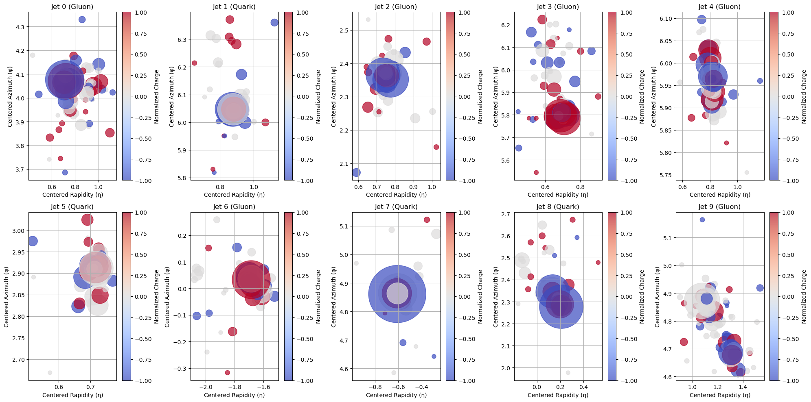

# **ParticleNet Variant for Quark-Gluon Jet Classification**

I based my work primarily on the architecture introduced in the paper:
**"ParticleNet: Jet Tagging via Particle Clouds" (Huilin Qu, Loukas Gouskos)**
but with a few twists to handle data efficiently and maximize performance.

---

## **Why This Project?**

The dataset was massive, so I had to find ways to efficiently process and extract useful insights from the jets I used. My goal was to leverage feature engineering, dynamic graph construction, and hyperparameter tuning to build an optimized version of ParticleNet using PyTorch Geometric.

---

## **Data Analysis & Feature Engineering**

Before jumping into model training, I did some data analysis to understand what features could be more discriminative. From both literature and my own plots, it’s clear that quark- and gluon-induced jets differ significantly in terms of:
- **Charge distribution**
- **Particle multiplicity**
- **Jet shape**

Each particle in the dataset had **four features**, but one was particularly crucial: **the PDG ID**, which tells us what type of particle it is. To fully exploit this information, I created two additional features:
1. **Charge:** Derived from PDG ID using a dictionary lookup.
2. **Particle Type Embedding:** Instead of treating PDG ID as just an integer, I used an embedding layer to create a learnable vector representation, allowing the model to better understand the relationships between different particle types.

Another key preprocessing step was **centering the jet**. Instead of using the standard **jet axis** as the reference point (as done in ParticleNet), I chose to center the jet around the **"hardest particle"**—the one with the highest \( p_T \). This helped highlight local structures better.

Lastly, I applied a **log transformation** to \( p_T \), which regularized the feature distribution and improved stability during training.

### **Jet Visualization**

Below is a visualization of some example quark and gluon jets in \( \eta-\phi \) space. The color represents the normalized charge, and the size of the markers indicates particle \( p_T \).

---

## **Model Architecture & Graph Construction**

The biggest challenge was designing the **model structure** and fine-tuning hyperparameters.

- I defined **three DynamicEdgeConv layers** (as in the original paper), where at each step, a graph is dynamically constructed using **k-nearest neighbors (KNN)** in the feature space.
- This approach allows the model to **adaptively learn both local and global jet features** rather than relying on a static adjacency matrix.
- I experimented with different pooling strategies:
  - **Mean pooling** consistently outperformed **max pooling** (as expected and noted in the ParticleNet paper).
  - **Attention pooling** helped improve results, especially given the limited dataset size.

For **graph construction**, I tested multiple values of \( k \) for KNN.
- \( k = 8, 16, 32 \) all performed **similarly**, so I opted for \( k = 8 \) to reduce computational complexity and prevent my PC from exploding.

---

## **Final Results & Evaluation**

For final evaluation, I used **only 25%** of the total jets (**500,000**).

- My best model achieved **83.3% accuracy** on test data, which is **very close to the 84% benchmark** reported in the ParticleNet paper.
- Considering that I trained this **entirely on my PC**, with limited hyperparameter tuning and feature engineering, I’m very pleased with the result!
